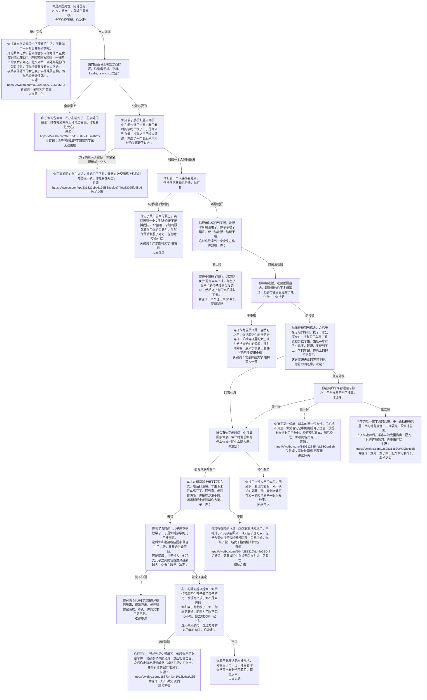

```mermaid
graph TD
    1[你是某国男性，简称国男，20岁，是学生，就读于某高校。\n今天你没有课，你决定:] -->|待在宿舍| 2[你打算在宿舍享受一下颓废的生活，于是叫了一份外卖开始打游戏。\n几轮厮杀过后，看到你舍友问你为什么在食堂对着女生DIY，你感觉莫名其妙，一番网上冲浪后才知道，社交网络上到处都是你的负面消息，而你今天并没有出过宿舍。\n事后事件源头的女生表示事件纯属虚构，而你已经社会性死亡。\n来源：https:\/\/weibo.com\/6239620007\/L6iAi5T2l\n关键词：深圳大学 食堂<br/>人在家中坐]
    1 -->|出去逛逛| 3[出门应该带上哪些东西好呢，你看看手机、平板、kindle、switch...决定：]
    3 -->|全都带上| 4[由于你的包太大，不小心碰到了一位学姐的屁股，她在社交网络上称你是色狼，你社会性死亡。\n来源：https:\/\/weibo.com\/2615417307\/JuLwat2bs\n关键词：清华老师回应学姐错告学弟<br/>无过则勉]
    3 -->|只带必要的| 5[你只带了手机和蓝牙耳机。你在学校逛了一圈，看了看时间该吃午饭了，于是你来到食堂，发现这里已经人满患，你选了一个看起来不太长的队伍走了过去：]
    5 -->|为了防止有人插队，你紧紧跟着前一个人| 6[你距离前面的女生太近，被她拍了下来，并且在社交网络上称你对她图谋不轨，你社会性死亡。\n来源：https:\/\/weibo.com\/p\/231522cba6129f538ccfce7f46a63025fc45e6<br/>欲加之罪]
    5 -->|和前一个人保持距离| 7[你和前一个人保持着距离，但是队伍移动得很慢，你打算：]
    7 -->|玩手机打发时间| 8[你忘了跟上前面的队伍，突然听到一个女生喊“你是不是插我队？！”接着一个玻璃瓶就碎在了你的后脑勺，虽然你最后制服了对方，但你也受伤住院。\n关键词：广东医科大学 玻璃瓶<br/>无妄之灾]
    7 -->|听歌就好| 9[你跟着队伍打到了饭，吃饭时耳机没电了，你草草收了起来，便一边吃饭一边玩手机。\n这时你注意到一个女生在偷你耳机，你：]
    9 -->|制止她| 10[你将小偷捉了现行，对方却表示“抛开事实不谈，你坐了我常坐的位子难道就没错吗”，然后砸了你的耳机扬长而去。\n关键词：华东理工大学 耳机<br/>捉贼拿脏]
    9 -->|假装没看到| 11[你继续吃饭，吃完饭回宿舍，刚吃饱的你不太想运动，但是电梯里已经站了几个女生，你决定：]
    11 -->|坐电梯| 12[电梯作为公共资源，当然可以用，你抱着这个想法走进电梯，却被电梯里的女生认为是抢占她们的资源，并对你网曝，后来学校禁止低楼层的男生使用电梯。\n关键词：北京师范大学 电梯<br/>高人一等]
    11 -->|走楼梯| 13[你爬楼梯回到宿舍，之后无惊无险的毕业，找了一家公司996，贷款买了车房，通过相亲结了婚，婚后一年有了个儿子，转眼儿子便到了上小学的年纪，你肩上的担子更重了。\n这天你破天荒的准时下班，你看时间还早，决定：]
    13 -->|回家休息| 14[难得有这空闲时间，你打算回家休息。停车时发现你的停车位被一陌生车辆占用，你决定：]
    13 -->|赚点外快| 15[你在网约车平台注册了账户，平台推来两份可接单，你选择：]
    14 -->|想办法联系车主| 16[车主在雨刮器上留了联系方式，电话打通后，车主下来开车离开了。回到家，老婆在洗澡，你躺在沙发小憩。迷迷糊糊中老婆叫你去接儿子，你：]
    14 -->|换个车位| 17[你换了个没人用的车位。回到家，发现门前有一双不认识的男鞋，开门看到老婆正在和一名陌生男子一起为爱鼓掌。\n同道中人]
    16 -->|去接| 18[你看了看时间，儿子差不多放学了，于是你将放学的儿子接回家。\n之后你和老婆响应国家号召生了二胎，并开始准备三胎。\n可是随着二儿子长大，他和大儿子之间的容貌差异越来越大，你看在眼里，决定：]
    16 -->|不接| 19[你难得有时间休息，迷迷糊糊地拒绝了，平时儿子不用接能回来，今天应该也可以。但是今天你儿子很晚都没回来，后来得知，你儿子被一名女子抱到楼上摔死。\n来源：https:\/\/weibo.com\/5044281310\/L44o2EDIJ\n关键词：男童被陌生女抱走后在附近小区坠亡<br/>切肤之痛]
    18 -->|装不知道| 20[你对两个儿子的容貌差异视若无睹，视如己出，老婆对你很满意，不久，你们又生了第三胎。<br>难得糊涂]
    18 -->|做亲子鉴定| 21[心中的疑问越来越大，你悄悄带着两个孩子做了亲子鉴定，发现两个孩子都不是自己的。\n你和妻子为此吵了一架，你决定离婚，同时为了眼不见心不烦，搬去和父母一起住。\n这天岳父敲门，说是为他女儿的事来赔礼，你决定：]
    21 -->|见面聊聊| 22[你打开门，没想到岳父带着刀，他趁你不防砍倒了你，又砍倒了你的父母，然后报警自首，之后你老婆出具谅解书，减轻了岳父的刑责，并带着你的家产改嫁了。\n来源：https:\/\/weibo.com\/1887344341\/L2LHwrUZ5\n关键词：彭州 岳父 灭门<br/>鸡犬不留]
    21 -->|不见| 23[你表示此事绝无回旋余地，对岳父闭门不见，他离去时你从窗户看到他带着刀，暗自庆幸。<br/>未来可期]
    15 -->|第一份| 24[你选了第一份单，叫车的是一位女性，目的地不算远，你凭着记忆中的路线开了过去，没想到在快到目的地时，乘客突然跳车，随后身亡，你被拘留二百天。\n来源：https:\/\/weibo.com\/1806128454\/L55Qeu5zh\n关键词：货拉拉司机 周某春<br/>逃出升天]
    15 -->|第二份| 25[叫车的是一位丰满的女性，手一直插在裤兜里，目的地有点远，中间要走一段高速公路。\n上了高速以后，乘客从裤兜里掏出一把刀，对你连捅数刀，你重伤住院。\n来源：https:\/\/weibo.com\/2628314830\/KxZ8Hcdje\n关键词：湖南一女子乘出租车拿刀刺司机<br/>血光之灾]
    15 -->|都不接| 14
```
